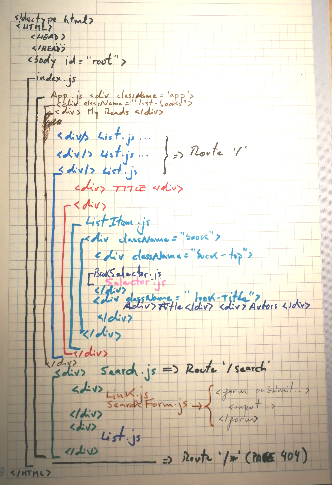

# About MyReads Project Implementation

## The following image represents a sketch of the design (sumarized) of the HTML and components created for this project:



# Things to take into account

# About `Switch` from 'react-router-dom'
I've used this module as an alternative to of nested `Routers` (from react-router) and `IndexRouter`:
```js
  <Router path='/'/>
    <IndexRuter component={List}>
    <Router path='/search' component={search}/>
  </Router>
  <Router path='/404' component={NotFound}/>
```

## About `Refs` HTML elements
I've used this functionality previously to this course and I think is the most elegant way to refer to an HTML element to catch their properties: https://reactjs.org/docs/refs-and-the-dom.html

## About `Third-party dependency`

- I couldn't find anything about this so I've decided to use [Lodash](https://lodash.com/)